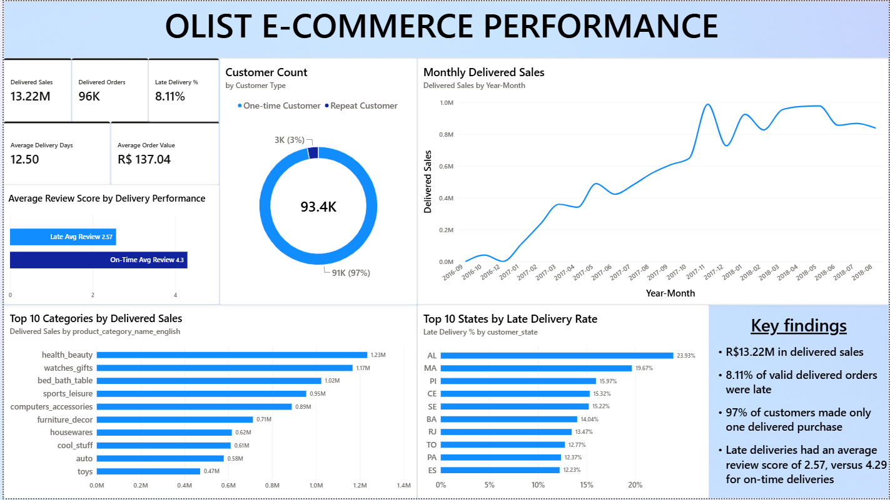

# Olist Brazilian E-Commerce Analysis

## Overview

A data analysis project based on the Olist Brazilian E-Commerce Public Dataset.

The project follows a complete data analysis workflow, starting with raw CSV files and ending with a Power BI dashboard.

The main focus was on understanding e-commerce sales, customers, products, orders, delivery performance, and reviews.

**Workflow:** `Python → PostgreSQL → Power BI`

## Key Findings

- Delivered sales were about **R$13.22M** across **96,478** delivered orders, with an average order value of **R$137.04**.
- **Health & beauty** was the highest-revenue category, followed by watches & gifts and bed & bath table.
- About **97%** of customers made only one delivered purchase; repeat customers were about 3% but had higher average spending per customer.
- Average delivery time was about **12.5 days**, and **8.11%** of valid delivered orders arrived later than estimated.
- Late-delivery rates varied by state, with Alagoas (23.93%) and Maranhão (19.67%) the highest.
- Late deliveries averaged a review score of **2.57**, compared with **4.29** for on-time deliveries.

## Dataset

The project uses the Olist Brazilian E-Commerce Public Dataset.

The dataset contains multiple related tables covering:

* Orders
* Order items
* Customers
* Products
* Sellers
* Payments
* Reviews
* Product categories
* Geolocation

The dataset contains 99,441 orders and 112,650 order-item records.

A key part of the analysis was understanding the difference between the order and order-item levels. Revenue calculations were therefore based on item-level data from the `order_items` table.

## Tools

* Python
* Pandas
* Jupyter Notebook
* PostgreSQL
* SQL
* Power BI
* GitHub

## Project Steps

### 1. Data Cleaning — Python

The raw CSV files were loaded and checked using pandas.

The cleaning and QA process included:

* Checking missing values
* Checking duplicate rows
* Checking data types
* Checking unique IDs
* Converting date columns to datetime
* Checking relationships between tables
* Investigating delivery date anomalies
* Handling missing product categories
* Reviewing product and review data quality

The cleaned tables were then loaded into PostgreSQL.

### 2. Data Storage — PostgreSQL

The cleaned datasets were stored as separate PostgreSQL tables.

The main tables include:

* `orders_clean_python`
* `order_items_clean_python`
* `customers_clean_python`
* `products_clean_python`
* `sellers_clean_python`
* `reviews_clean_python`
* `payments_clean_python`
* `category_translation_clean_python`
* `geolocation_clean_python`

### 3. SQL Analysis

SQL was used to analyse the cleaned data.

The analysis included:

* Monthly sales
* Monthly orders
* Average order value
* Category revenue
* Customer order frequency
* One-time vs repeat customers
* Customer spending
* Delivery time
* Late delivery rate
* State-level delivery performance
* Delivery performance and review scores

### 4. Power BI

The PostgreSQL data was connected to Power BI.

Relationships were created between the tables and a DateTable was used for time-based analysis.

The dashboard was then built using the results from the SQL analysis.

## Dashboard

[Download Power BI Dashboard (.pbix)](https://drive.google.com/uc?export=download&id=18jNaoiD8lLlKXdqX3dUH67FN1WebgUE_)

The Power BI dashboard contains:

* Sales KPIs
* Order KPIs
* Monthly sales trend
* Category revenue analysis
* Customer purchase behaviour
* Delivery performance
* State-level delivery analysis
* Review score comparison

The dashboard was designed to keep the analysis easy to explore without adding unnecessary visual complexity.

## Project Report and Presentation

The detailed findings, calculations, and analysis are documented in the project report and summarised in a presentation:

* Project report: [`Olist_Ecommerce_Analysis_Styled.pdf`](Olist_Ecommerce_Analysis_Styled.pdf)
* Presentation: [`Olist-E-Commerce-Analysis.pptx`](Olist-E-Commerce-Analysis.pptx)

## Limitations

* This is a historical dataset, so the results do not describe Olist's current performance.
* The repeat-customer percentage is affected by the limited observation period.
* The comparison between delivery performance and review scores shows an association in the data. It does not prove that late delivery was the only reason for lower review scores.

## How to Run

### Python

1. Install Python and the required libraries.
2. Place the Olist CSV files in the project's data directory.
3. Open the Jupyter Notebook.
4. Run the data cleaning and QA steps.

### PostgreSQL

1. Install PostgreSQL.
2. Create a database.
3. Load the cleaned tables generated from the Python workflow.
4. Run the SQL analysis file.

### Power BI

1. Open the `.pbix` file.
2. Update the PostgreSQL connection if required.
3. Refresh the data.
4. Explore the dashboard.
4. Explore the dashboard.

